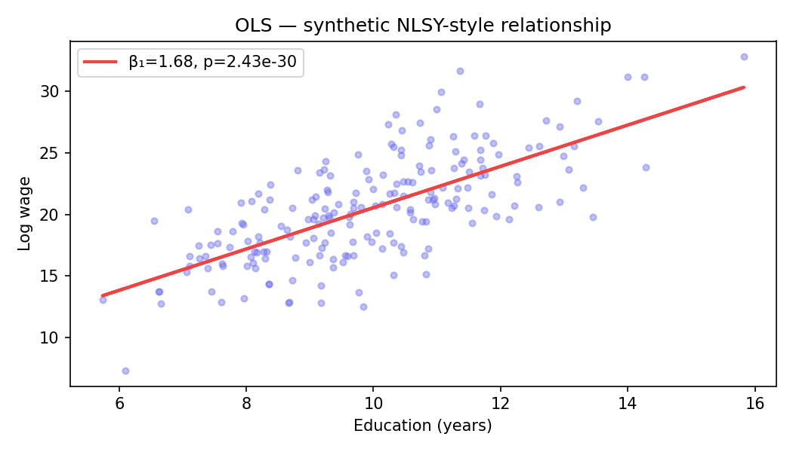
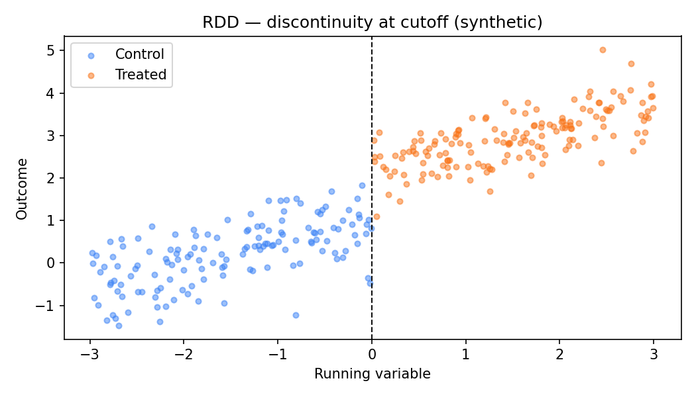

# mitx-14310x-causal-inference

**MITx 14.310x — Data Analysis in Social Science**

Inferência causal reproduzível: OLS, variáveis instrumentais (2SLS) e regression discontinuity design (RDD).

---

## Métodos e identificação

| Método | Identificação causal | Demo |
|--------|---------------------|------|
| **OLS** | Correlacional — controlando covariáveis | `01_ols/demo_ols.R` |
| **IV / 2SLS** | Variável instrumento exógena | `02_iv/demo_iv.R` |
| **RDD** | Discontinuidade no cutoff | `03_rdd/demo_rdd.R` |

### OLS — relação educação × salário (synthetic)



### RDD — salto no tratamento no cutoff



O estimador RDD local compara limites `lim_{x↓0} E[Y|X]` vs `lim_{x↑0} E[Y|X]`.

---

## Fórmulas (portfólio §06)

```
ATE = E[Y(1) − Y(0)]
DiD = (Ȳ_treat,post − Ȳ_treat,pre) − (Ȳ_ctrl,post − Ȳ_ctrl,pre)
```

## Setup

```bash
# R demos (dados sintéticos)
Rscript 01_ols/demo_ols.R
python docs/generate_figures.py   # figuras Python
```

## Autor

**Guarantã Almeida** — [github.com/guaranta](https://github.com/guaranta)
